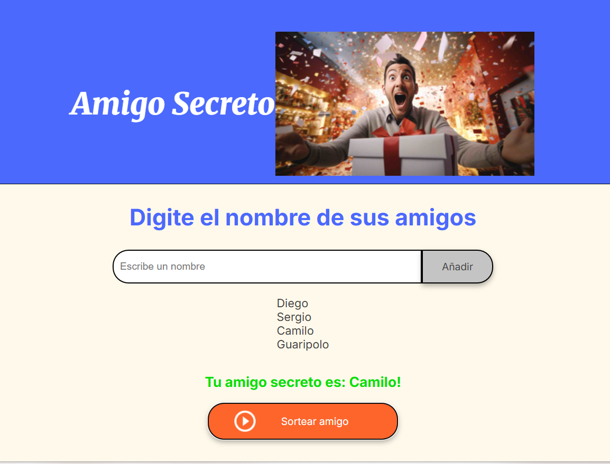

# Reto #5: Amigo Secreto - Alura Latam / Oracle ONE G9

-brightgreen)


Este repositorio contiene la solución para el Challenge "Amigo Secreto", correspondiente al track "Principiante en Programación G9" de Alura Latam en colaboración con Oracle Next Education. El objetivo principal fue desarrollar una aplicación web interactiva desde cero para gestionar y realizar el sorteo de un amigo secreto, aplicando los conceptos fundamentales de HTML, CSS y JavaScript.

## 🎬 Demostración del Proyecto



## ✨ Características Principales

El proyecto, en su estado actual, cuenta con las siguientes funcionalidades:

-   **Añadir Amigos:** Permite a los usuarios ingresar nombres en un campo de texto y añadirlos a una lista de participantes.
-   **Validación de Entrada:** El sistema no permite añadir nombres vacíos, mostrando una alerta al usuario.
-   **Visualización Dinámica:** La lista de amigos añadidos se muestra en tiempo real en la pantalla, actualizándose con cada nueva adición.
-   **Limpieza Automática:** El campo de texto se limpia automáticamente después de que un nombre es añadido, mejorando la experiencia de usuario.
-   **Sorteo Aleatorio:** Al hacer clic en el botón "Sortear", el sistema selecciona aleatoriamente a una persona de la lista de participantes y la muestra como la ganadora.
-   **Validación del Sorteo:** No es posible realizar un sorteo si no hay participantes en la lista.

## 🚀 Tecnologías Utilizadas

-   **HTML5:** Para la estructura y el contenido de la página web.
-   **CSS3:** Para el diseño, la presentación y la estética de la aplicación, utilizando conceptos como Flexbox y variables CSS para un diseño mantenible.
-   **JavaScript (ES6+):** Para toda la lógica interactiva, incluyendo:
    -   Manipulación del DOM (Document Object Model).
    -   Manejo de eventos (clicks en botones).
    -   Uso de arrays para gestionar el estado de la aplicación (la lista de amigos).
    -   Funciones para modularizar el código (`agregarAmigo`, `actualizarLista`, `limpiarCaja`, `sortearAmigo`).
    -   Uso de `Math.random()` para la lógica del sorteo.

## 🛠️ Herramientas y Proceso

-   **Git y GitHub:** Para el control de versiones del código y para alojar el proyecto de forma pública.
-   **Trello:** Se utilizó un tablero de Trello, basado en la plantilla proporcionada por Alura, para la gestión y seguimiento de las tareas del proyecto, siguiendo un flujo de trabajo Kanban (Backlog, En Desarrollo, Concluido).

## 🏁 Cómo Ejecutar el Proyecto

1.  Clona este repositorio en tu máquina local:
    ```bash
    git clone https://github.com/Bryckson/Challenge-Amigo-Secreto---Alura-Latam.git
    ```
2.  Navega a la carpeta del proyecto:
    ```bash
    cd Challenge-Amigo-Secreto---Alura-Latam
    ```
3.  Abre el archivo `index.html` en tu navegador web preferido.

¡Y listo! Ya puedes empezar a añadir amigos y realizar sorteos.

## 👨‍💻 Autor

-   **Bryckson**
-   **Email**brycksong@gmail.com  
-   [LinkedIn](https://www.linkedin.com/in/bryckson-gutierrez)

## 🙏 Agradecimientos

Un agradecimiento especial a todo el equipo de instructores de **Alura Latam** y **Oracle Next Education** por proponer este desafío, que ha sido una excelente oportunidad para poner en práctica y consolidar los conocimientos adquiridos en el curso.
